<div align="center">


# 🔥 Pixel World

**An infinite procedural caveman world that paints every pixel of its own art.**

*No image files. No build step. One JavaScript file and a dream.*

[](LICENSE)
[](https://developer.mozilla.org/en-US/docs/Web/JavaScript)
[](https://threejs.org)
[](#-quick-start)
[](#-contributing)


*Every sprite above was drawn at runtime by ~40 lines of `fillRect` calls — trees, fish, fire and folk.*

</div>

---

## 🌅 What is this?

You wake up on a shore you've never seen, because it has never existed.
Endless voxel terrain rolls out in every direction — deserts, jungles, forests,
snowfields — generated fresh from a seed each time you press 🌍.

A small tribe of cavemen lives here. Each one looks different — skin, hair, eyes,
beard — each one gets tired, curls up under the stars by the fire, and wakes with
the sun. And **you** teach them things: strike the campfire to discover *Fire*,
wade into the sea to discover *Water*, and watch their knowledge book fill up,
discovery by discovery.

> Fire good. Water good. Pull requests even better. 🚀

### Highlights

- 🌍 **Infinite procedural terrain** — chunked voxels, four biomes, beaches, caves, seas
- 🎨 **Zero image assets** — all art is painted live onto canvases (see [the gallery](#-asset-gallery))
- 🌬️ **Wind-swept vegetation** — instanced billboards with regional wind fields and seasonal crossfades
- 👥 **Living villagers** — unique procedurally-generated looks & names, aging, sleep cycles, squad commands
- 📖 **Knowledge book** — an unlockable tech tree: 🔥 Fire → 🌊 Water → 🛠 Toolmaking → …
- ⚡ **Energy system** — every villager runs on a daily battery; collapse at zero, rise at dawn
- 🐟 **A living sea** — schools of six fish species that leap above the waves
- 🗺️ **Map & icon modes**, space view, top view, camera tweens, time controls ×1–×25
- 🧪 **Headless-testable** — a built-in `window.__DBG` debug API drives every system

## 🚀 Quick start

```bash
git clone https://github.com/FREECANDY-DEV/pixel-world.git
cd pixel-world
npm start          # serves on http://localhost:8000
```

No dependencies, no bundler, no transpiler. Any static server works too:

```bash
python3 -m http.server 8000   # or npx serve, or nginx…
```

Then open **http://localhost:8000** and go discover fire. Works on desktop
(keyboard + mouse) and mobile (joystick + touch buttons).

## 🕹️ Controls

| Input | Action |
|---|---|
| **W / A / S / D** | Fly across the world |
| **R / F** | Dive below ground / soar higher |
| **Mouse drag** | Orbit & zoom the camera |
| **Click a villager** | Select them |
| **Joystick / WASD while selected** | Steer your villager on foot |
| **⬚ button** | Box-select multiple villagers |
| **🔥 Strike the campfire** | Gather the tribe — unlocks *Fire* 📖 |
| **📖 button** | Open the knowledge book |
| **» Assets panel** | Browse every species in the world |
| **🌍 / 🔄 / 🗺️ / 🏠** | New world / auto-spin / top view / fly home |
| **❚❚ + slider** | Pause time or run it up to ×25 |

## 🧠 Gameplay systems

### The knowledge tree 📖

Discoveries unlock permanently (stored in `localStorage`) and light up the book:

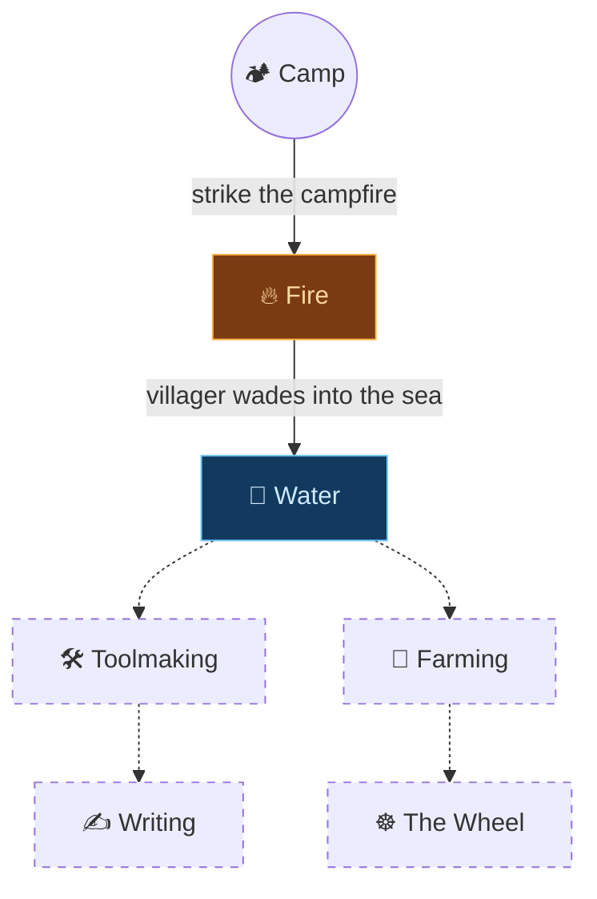

Every unlock fires a golden toast, updates the tree UI, and changes villager
behaviour — before *Water* is known they refuse to set foot near the sea;
afterwards shallow wading becomes part of life.

### The daily energy cycle ⚡

Each villager carries a 0–100 battery shown as a bar on their name tag:

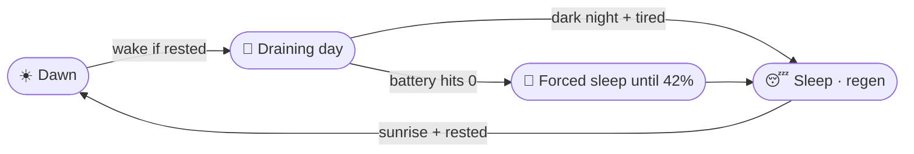

Selected villagers hold position until *you* push the stick — no wandering off
on their own (except a safety paddle if they're sinking in deep water).

## 🐟 The living sea

Six fish species swim in cell-based schools, complete with two-frame tail
animation — rendered from the same painter used everywhere else in the game
(this is a real loop exported straight from the code):

<div align="center">


*The clownfish's actual swim cycle, frame-for-frame.*

</div>

<details>
<summary><b>All six species</b></summary>

| Clownfish | Blue Tang | Angelfish |
|:---:|:---:|:---:|
|  |  | 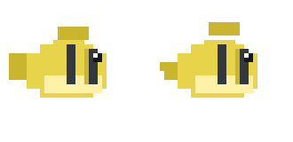 |

| Puffer | Sardine | Tuna |
|:---:|:---:|:---:|
| 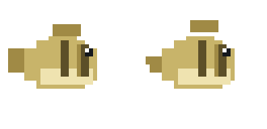 | 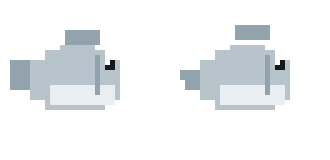 |  |

</details>

## 🌳 Asset gallery

Everything below is generated by code at runtime — these PNGs were produced by
re-running the game's own painters headlessly ([see how](#-testing--debug-hooks)).
Full catalog in [`SPRITESHEET.md`](SPRITESHEET.md).

<details open>
<summary><b>Trees & plants</b></summary>

| Oak | Pine | Birch | Maple |
|:---:|:---:|:---:|:---:|
|  |  |  |  |

| Spruce | Snow Pine | Jungle | Palm |
|:---:|:---:|:---:|:---:|
|  |  |  | 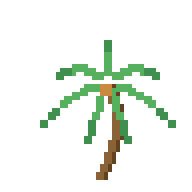 |

| Acacia | Apple | Bamboo | Dead Tree |
|:---:|:---:|:---:|:---:|
| 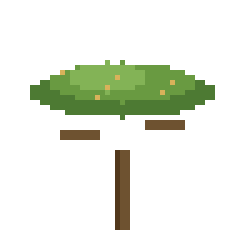 | 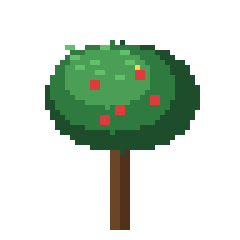 |  |  |

| Cactus | Agave | Shrub | Berry Bush |
|:---:|:---:|:---:|:---:|
|  | 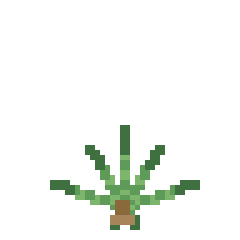 | 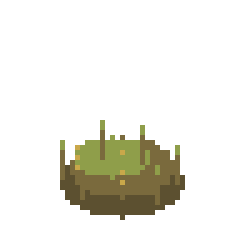 |  |

| Fern | Blossom | Bramble | Greatbush |
|:---:|:---:|:---:|:---:|
| 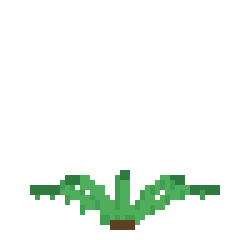 | 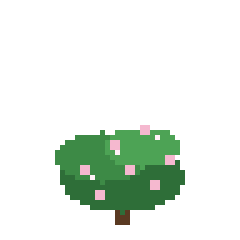 | 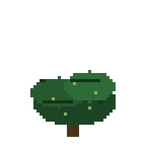 | 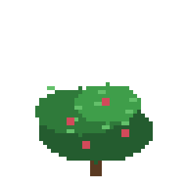 |

| Frostbush | Tumbleweed | Boulder | Rock & Pebble |
|:---:|:---:|:---:|:---:|
|  | 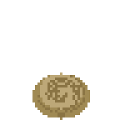 | 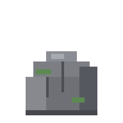 |  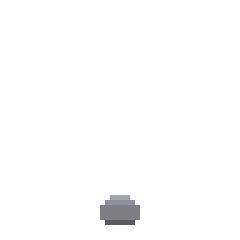 |

</details>

<details>
<summary><b>The campfire & the folk</b></summary>

<div align="center">

| Campfire | Villager face |
|:---:|:---:|
|  |  |

*Strike it to gather the tribe. Every villager's face, hair and beard is unique.*

</div>

</details>

## 🏗️ Architecture

One file, [`main.js`](main.js), organized into clear sections — plus a thin HTML
shell and stylesheet. three.js handles rendering; everything else is handmade.

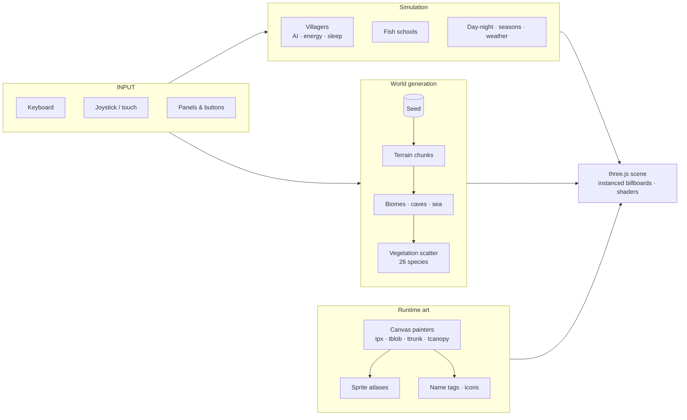

Notable engineering bits:

- **Instanced billboard vegetation** with a custom vertex shader for wind sway
  and slope-aware occlusion biasing so sprites never sink into hillsides
- **Chunked infinite terrain** with biome blending, beaches, sea level and caves
- **Golden-angle campfire ring slots**, excitement decay and reaction bubbles
- **Camera tween system** (home framing, campfire reframe) with cubic easing
- **Icon LOD mode** — far chunks swap to tiny map chips for performance

## 🧪 Testing & debug hooks

The game exposes a `window.__DBG` API designed for headless smoke tests
(Chromium + puppeteer-core, zero extra setup):

```js
__DBG.version()            // current version string
__DBG.cavemen()            // villager roster
__DBG.strike()             // trigger the campfire gathering
__DBG.know()               // knowledge state → { fire, water, … }
__DBG.unlock('water')      // force-unlock a node
__DBG.energy(0)            // read villager #0's battery
__DBG.setHour(22)          // jump to night (bedtime AI kicks in)
__DBG.tpVillager(0, x, z)  // teleport someone into the sea 😱
__DBG.fishCount()          // how many fish are swimming
__DBG.setStick(x, z)       // push a selected villager's joystick
```

A typical headless check: boot the page, call `__DBG.strike()`, assert
`__DBG.know().fire === true`, assert zero console errors.

## 🤝 Contributing

Caveman-friendly rules:

1. **Fork & branch** — `git checkout -b my-cave`
2. **Small PRs win** — one feature or fix per pull request
3. **Keep art procedural** — new sprites must be canvas painters, not image files
4. **Test what you can** — at minimum run the game and poke your feature via
   `window.__DBG`; include the commands you used in the PR description
5. **Match the style** — plain ES2020+, no build tools to fight

<details>
<summary><b>🎨 Add your own tree species in five minutes</b></summary>

1. Open `main.js` and find `TREE_KINDS` — each entry is a painter config keyed by name
2. Write your painter with the provided helpers:
   - `ttrunk(c, x, y, w, h, bark)` — shaded trunk with lit edge, knots, root flare
   - `tcanopy(c, cx, cy, r, leaf)` — volumetric canopy with AO layer and dithered shine
   - `tpx(c, x, y, w, h)` — the universal pixel primitive
3. Add your species to `KIND_ORDER` so it appears in the Assets panel and map icons
4. Seasonal variants come free — painters receive the season row automatically
5. Regenerate the gallery (`node tools/export-assets.js`) and add a row above 🌟

</details>

Ideas waiting for a cave-mate are tracked in [`TODO.md`](TODO.md) — toolmaking,
farming, fishing behaviour, sound design, save/load… grab one!

## 🗺️ Roadmap

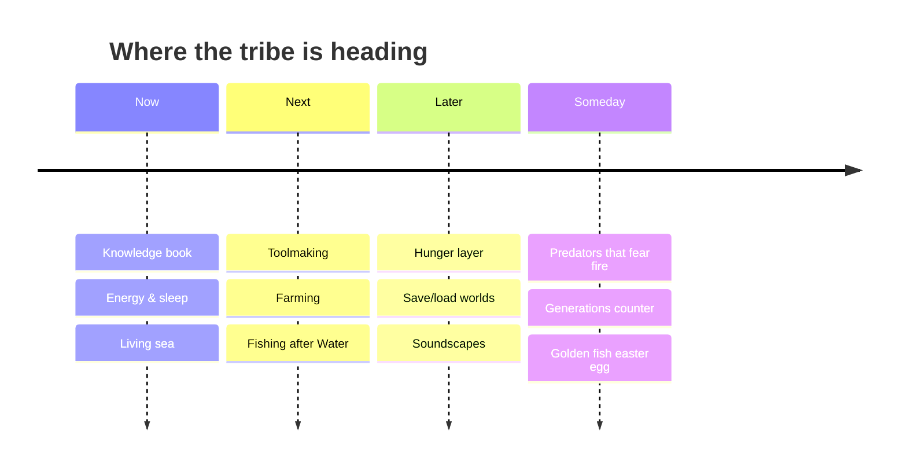

## 🙏 Credits

Built with [three.js](https://threejs.org). Every other pixel, line and idea
came out of this repository's own little tribe.

<div align="center">


**Pixel World** — keep the fire burning. 🔥

Licensed under the [MIT License](LICENSE).

</div>
