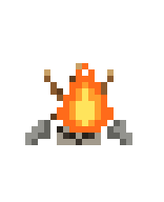
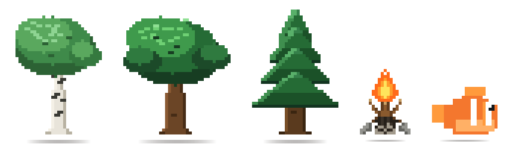
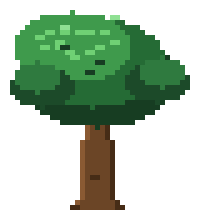
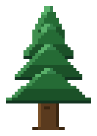
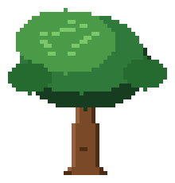
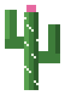
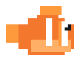
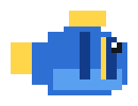
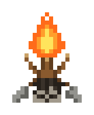
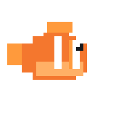

<div align="center">



# Pixel World

### An infinite caveman world that paints its own art.

**Every sprite you see is drawn by code at runtime** — there is not a single
image file in this game. One seed grows an endless world of deserts, jungles,
forests and snow; a little tribe wakes, explores, discovers fire, and sleeps
by the campfire under a full day-night sky.

[](LICENSE)
[](https://developer.mozilla.org/en-US/docs/Web/JavaScript)
[](https://threejs.org)
[](#-quick-start)
[](CONTRIBUTING.md)



*Left to right: birch, oak, pine, the campfire, and a clownfish — every pixel placed by `fillRect`.*

[🎮 Play it](#-quick-start) · [🕹️ Controls](#️-controls) · [🧠 How it works](#-how-it-works) · [🎨 The art](#-the-art-all-painted-by-code) · [🤝 Contribute](CONTRIBUTING.md)

</div>

---

## 🎮 Quick start

New to coding? No problem — you only need three commands:

```bash
git clone https://github.com/FREECANDY-DEV/pixel-world.git
cd pixel-world
npm start
```

Then open **http://localhost:8000** in your browser. That's the whole install:
no dependencies, no build tools, nothing to configure.

<details>
<summary>Don't have Node.js? Any static server works.</summary>

```bash
python3 -m http.server 8000     # Python
npx serve .                     # or Node via npx
```

…or just double-click `index.html` — most features work straight from disk.
</details>

## 🕹️ Controls

| | Input | Action |
|---|---|---|
| ⌨️ | **W A S D** · **R / F** | Fly across the world · dive / climb |
| 🖱️ | **Drag** | Orbit & zoom |
| 👆 | **Click a villager** | Select them, then steer with WASD or joystick |
| 🔥 | **Strike the campfire** | Gather the tribe → unlock *Fire* 📖 |
| 📖 | **Book button** | Open the knowledge tree |
| ⏩ | **Time slider** | Pause up to ×25 speed |

On phone? There's a joystick and touch buttons built in.

## 🧠 How it works

Pixel World is one plain JavaScript file ([`main.js`](main.js), ~8k lines) on top
of [three.js](https://threejs.org). No frameworks, no bundler — open the file and
every system is right there, behind a banner comment:


A few things we're proud of:

- **Procedural everything** — terrain, weather, villager faces (no two alike),
  even this README's pictures are generated from the game's own painters
- **Knowledge tree** — strike the fire, wade into the sea, and discoveries
  unlock permanently in the 📖 book (`localStorage` saves your progress)
- **Daily energy** — villagers run out of battery, collapse dramatically, sleep
  it off, and wake at dawn. Watch long enough and you'll see the whole rhythm
- **Headless-testable** — a `window.__DBG` API lets tests strike fires, skip
  time and teleport villagers without touching the mouse

## 🎨 The art — all painted by code

There are no PNGs inside the game. Trees, fish, fire and faces come from tiny
painter functions that place colored rectangles onto canvases at load time.
The images below were rendered by re-running those exact painters headlessly —
**pixel-for-pixel what you see in-game**, on transparent backgrounds:

<div align="center">

| 🌳 A few of 26 species | 🐟 A few of 6 fish |
|:---:|:---:|
| &nbsp;&nbsp;&nbsp; | &nbsp;&nbsp; |

| 🔥 The campfire | 😀 A villager's face — everyone's is unique |
|:---:|:---:|
|  |  |

</div>

And because painters are just functions, animation comes free — here's the
clownfish's real swim cycle, frame-for-frame from the code:

<div align="center">

</div>

Want the full catalog of all 26 plant and rock species?
[`SPRITESHEET.md`](SPRITESHEET.md) documents every painter.

## 🧪 Testing

Smoke-test any change headlessly with the built-in debug API:

```js
__DBG.version()          // e.g. "v34"
__DBG.strike()           // light the campfire gathering
__DBG.know()             // → { fire: true, water: false, … }
__DBG.setHour(22)        // jump to night — bedtime AI kicks in
__DBG.energy(0)          // villager #0's battery level
__DBG.fishCount()        // fish currently swimming
```

`node --check main.js` catches syntax slips; a five-line puppeteer script
catches everything else. See [`CONTRIBUTING.md`](CONTRIBUTING.md) for a
copy-paste test harness.

## 🤝 Contributing

**First time contributing? You're exactly who we made this for.**
The codebase is small, dependency-free and commented — a great first repo to
learn on. Good starter missions:

- 🌳 Paint a new tree species (~30 lines with the `ttrunk` / `tcanopy` helpers)
- 🐟 Add a fish species to `FISH_KINDS`
- 📖 Wire up one of the stubbed knowledge nodes (Toolmaking, Farming…)

Everything you need is in [`CONTRIBUTING.md`](CONTRIBUTING.md) — setup,
ground rules, a test template and the species recipe.

## 🗺️ Roadmap

| Now | Next | Someday |
|---|---|---|
| Knowledge book · energy · living sea | Toolmaking · Farming · fishing | Save/load · soundscapes · predators that fear fire |

Full list lives in [`TODO.md`](TODO.md).

---

<div align="center">

<br>
<strong>Keep the fire burning.</strong> 🔥<br>
Licensed under the <a href="LICENSE">MIT License</a>.

</div>
