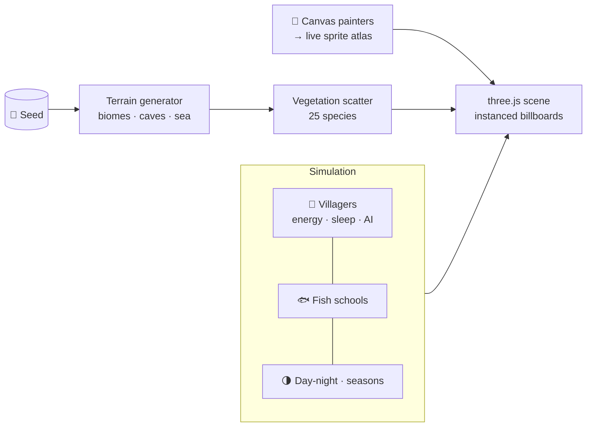
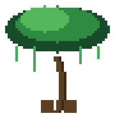
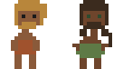

<div align="center">


# Pixel World

### An infinite caveman world that paints its own art.

**Every sprite you see is drawn by code at runtime** — there is not a single
image file in this game. One seed grows an endless world of deserts, jungles,
forests and snow; a little tribe sleeps by the fire until you strike it — then
wakes, explores, discovers fire, and lives through a full day-night cycle.
A game year is 365 days in four ~91-day seasons, ticking 60× faster than
real time.

[](LICENSE)
[](https://developer.mozilla.org/en-US/docs/Web/JavaScript)
[](https://threejs.org)
[](#quick-start)
[](CONTRIBUTING.md)


*Left to right: birch, oak, pine, the campfire, and a clownfish — every pixel placed by `fillRect`.*

[🎮 Play it](#quick-start) · [🕹️ Controls](#controls) · [✨ Features](#features) · [🧠 How it works](#how-it-works) · [🎨 The art](#the-art--all-painted-by-code) · [🧪 Testing](#testing) · [🤝 Contribute](CONTRIBUTING.md)

</div>

---

## 🎮 Quick start

New to coding? No problem — you only need three commands:

```bash
git clone https://github.com/FREECANDY-DEV/pixel-world.git
cd pixel-world
npm start
```

Then open **http://localhost:8000** in your browser. That's the whole install:
no dependencies, no build tools, nothing to configure.

<details>
<summary>Don't have Node.js? Any static server works.</summary>

```bash
python3 -m http.server 8000     # Python
npx serve .                     # or Node via npx
```

…or just double-click `index.html` — most features work straight from disk.
</details>

## 🕹️ Controls

| | Input | Action |
|---|---|---|
| ⌨️ | **W A S D** · **R / F** | Fly across the world · dive / climb — dive under the sea for the underwater view |
| 🖱️ | **Drag** | Orbit & zoom |
| 👆 | **Click a villager** | Select them, then steer with WASD or joystick |
| ⛳ | **Move button** | Rides above the selected human — arm it, tap the world, and they walk there (whole squad follows) |
| 🔥 | **Strike the campfire** | Gather the tribe → unlock *Fire* 📖 |
| 📖 | **Book button** | Open the knowledge tree |
| ⏩ | **Time slider** | Pause up to ×25 speed |
| 📦 | **Box-select** | Drag a marquee to recruit a squad, then steer them together |

On phone? There's a joystick and touch buttons built in.

## ✨ Features

### 🏔️ A world that generates itself
- **Four biomes** — desert, jungle, forest and snow — plus beaches, a living
  sea and caves, all grown from one seed via layered noise
- **25 plant & rock species**, each with its own painter: oaks, pines, birch,
  maple, palm, jungle giants, bamboo, cactus, agave, berry and blossom bushes,
  brambles, pebbles, rocks and boulders — even a tumble bush
- **Full seasons**: a 365-day calendar in four ~91-day seasons. The last 28%
  of each season eases into the next, and the in-world trees crossfade their
  foliage — spring blossoms, summer green, autumn gold, winter snow — with a
  shader blend, so you can *watch* the forest change colour
- **Weather that bites**: clear skies, rain, storms (with lightning strikes),
  snowfall and dust storms, each with its own wind, fog, dimming and stars

### 🌗 A rhythm of day, night and sleep
- Sun and moon discs cross the sky, stars come out, dusk tints everything
- **Daily energy**: every villager has a battery (0–100) that drains while
  awake. At zero they collapse dramatically, sleep it off, and wake at dawn —
  tired villagers head for bed on dark nights on their own
- Game time runs **60× faster than real life**, so you can watch a whole
  day-night cycle (and seasons turn over) in minutes

### 👥 A tribe with a mind of its own
- **No two villagers alike** — skin, hair, eyes, style and beard are rolled
  per person, they age through life stages, and an anatomy view shows off
  their stats
- They gather at the campfire in a golden-angle ring, react with bubbles,
  sleep curled up (with rising ZZZs), and bolt from lightning
- **Select & command**: click to pick, steer with WASD/joystick, or box-select
  a whole squad. Selected humans hold their ground — nothing moves them but you
- **⛳ Move command (v35)**: arm the floating Move button above the picked
  human and tap the world — they walk there, and squad mates fan out behind
  them in a loose trail instead of piling onto one spot. A little green pixel
  flag marks the destination
- **Squad follow (v35)**: squad members trail the leader at personal offsets —
  behind a walking leader, spread around a standing one — and hustle up to 65%
  faster when they lag so the pack never strings out

### 📖 The knowledge book
- Strike the campfire to unlock **Fire**, command a villager to wade into the
  sea to unlock **Water** — every discovery pops a golden toast and unlocks
  permanently in the 📖 tree (saved in `localStorage`)
- Four more nodes are stubbed and waiting: **Toolmaking, Farming, Writing,
  The Wheel**
- Knowledge changes behaviour: until Water is known, villagers refuse to
  wander into the wet

### 🐟 A sea that's alive
- Six fish species (sardine, clownfish, blue tang, tuna and friends), each
  painted with a two-frame swim cycle
- **v35: sparse & deep** — schools cruise fully submerged 1.8–4+ blocks down,
  occasional passing shoals rather than a rain of pixels, and they vanish past
  320 units so the distance stays clean
- Dive under the surface: murky blue fog, dimmed sun, drifting light rays,
  and fish swimming right beside you
- **Map icons (v35)**: zoom out and the sea is flood-filled into connected
  water bodies, with exactly **one marker per (water body, fish species)** —
  at most six spots for a whole ocean

### 🗺️ Map & camera modes
- **Icon mode**: zoom out and the world turns into a map — tree clusters,
  camps, people and fish markers. **v35** makes the markers *honest*: they
  show the exact seasonal art the trees have right now (blended the same way
  the in-world shader blends), float above the tallest tree, and render in a
  late transparent pass so no terrain can swallow them
- **Space mode**: zoom way out to see the whole planet
- **Top view**, camera tweens that frame the camp when you strike the fire,
  and a globe popup with camp stats (births, deaths, age)

## 🧠 How it works

Pixel World is one plain JavaScript file ([`main.js`](main.js), ~8.5k lines) on top
of [three.js](https://threejs.org). No frameworks, no bundler — open the file and
every system is right there, behind a banner comment:



A few things we're proud of:

- **Procedural everything** — terrain, weather, villager faces (no two alike),
  even this README's pictures are generated from the game's own painters
- **Runtime-painted art** — species live as painter functions that place
  coloured rectangles onto canvases at load time; the results are baked into
  instanced billboards and a shared atlas. Animation is just repainting or
  crossfading rows
- **Seasonal crossfade** — every species paints one summer cell; spring,
  autumn and winter cells are derived programmatically, and the vertex shader
  blends between rows as the calendar turns. The map icons reuse the *same*
  rows at the *same* weight, so the zoomed-out map matches the world pixel
  for pixel
- **Knowledge tree** — strike the fire, wade into the sea, and discoveries
  unlock permanently in the 📖 book (`localStorage` saves your progress)
- **Daily energy** — villagers run out of battery, collapse dramatically,
  sleep it off, and wake at dawn. Watch long enough and you'll see the whole
  rhythm
- **Realistic calendar** — a year is 365 game days in four ~91-day seasons,
  and game time still runs 60× faster than real life
- **Underwater world** — dive below the surface and the sea swallows the view:
  murky blue fog, dimmed sun, drifting light rays, and fish schools swimming
  right beside you (they only gather where the water is 3+ blocks deep)
- **Headless-testable** — a `window.__DBG` API lets tests strike fires, skip
  time and teleport villagers without touching the mouse
- **Correct layering** — vegetation and map icons render in a late transparent
  pass (depth-tested, but never depth-written), so sprites can't be swallowed
  by the blocks beneath them while real hills still hide things behind them

## 🎨 The art — all painted by code

There are no PNGs inside the game. Trees, fish, fire and faces come from tiny
painter functions that place colored rectangles onto canvases at load time.
The images below were rendered by re-running those exact painters headlessly —
**pixel-for-pixel what you see in-game**, on transparent backgrounds:

<div align="center">

| 🌳 A few of 25 species | 🐟 A few of 6 fish |
|:---:|:---:|
| &nbsp;&nbsp;&nbsp;&nbsp; | &nbsp;&nbsp; |

| 🔥 The campfire | 😀 A villager's face — everyone's is unique |
|:---:|:---:|
|  |  |

</div>

The **caveman & cavewoman models are animated**: their pixel art re-rolls
every **3 seconds** into a different look from the same variant pool the
tribe spawns from — hairstyles, beards, skin and clothes — so one image
shows the variety you'll meet in-game:

<div align="center">

</div>

And because painters are just functions, animation comes free — here's the
clownfish's real swim cycle, frame-for-frame from the code:

<div align="center">

</div>

Want the full catalog of all 25 plant and rock species?
[`SPRITESHEET.md`](SPRITESHEET.md) documents every painter.

## 🧪 Testing

Smoke-test any change headlessly with the built-in debug API:

```js
__DBG.version           // debug API version (a number; the game itself is v35)
__DBG.strike()           // light the campfire gathering
__DBG.know()             // → { fire: true, water: false, … }
__DBG.setHour(22)        // jump to night — bedtime AI kicks in
__DBG.energy(0)          // villager #0's battery level
__DBG.fishCount()        // fish currently swimming
__DBG.action(true)       // arm the Move command
__DBG.move(x, z)         // send the picked human (and squad) walking there
__DBG.rebuildIconAtlas() // force the seasonal map chips to repaint
__DBG.fishIconLayer      // the global (per water-body) fish marker layer
```

`node --check main.js` catches syntax slips; a five-line puppeteer script
catches everything else. See [`CONTRIBUTING.md`](CONTRIBUTING.md) for a
copy-paste test harness.

## 🤝 Contributing

**First time contributing? You're exactly who we made this for.**
The codebase is small, dependency-free and commented — a great first repo to
learn on. Good starter missions:

- 🌳 Paint a new tree species (~30 lines with the `ttrunk` / `tcanopy` helpers)
- 🐟 Add a fish species to `FISH_KINDS`
- 📖 Wire up one of the stubbed knowledge nodes (Toolmaking, Farming…)

Everything you need is in [`CONTRIBUTING.md`](CONTRIBUTING.md) — setup,
ground rules, a test template and the species recipe.

## 🗺️ Roadmap

| Now | Next | Someday |
|---|---|---|
| Knowledge book · energy · Move command · living sea | Toolmaking · Farming · fishing | Save/load · soundscapes · predators that fear fire |

Full list lives in [`TODO.md`](TODO.md).

---

<div align="center">

<br>
<strong>Keep the fire burning.</strong> 🔥<br>
Licensed under the <a href="LICENSE">MIT License</a>.

</div>
