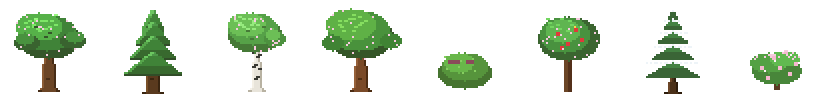
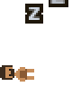
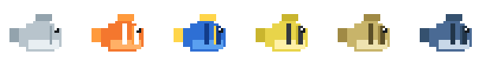
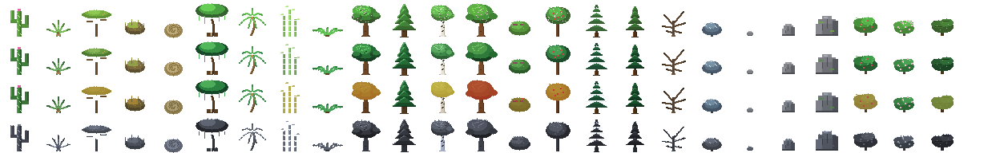
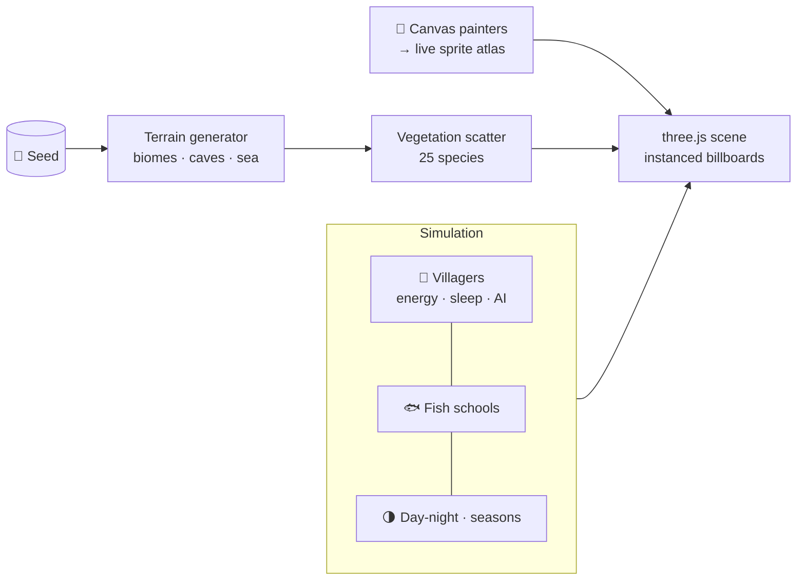
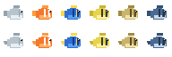

<div align="center">


# ⛰️ Pixel World: Stone Age Meets Code Magic! 🚀

### *An infinite procedural caveman universe that paints 100% of its own pixel art in real-time — zero image files attached!*

**Every tree, fish, flame, star, and caveman you see is drawn on-the-fly by code.** 
One seed sprouts an endless living world of scorching deserts, lush jungles, golden autumn forests, and freezing snowpeaks. A cute little tribe sleeps around the warm campfire until you strike the logs — then they leap up with a startled hop, explore the wilderness, discover fire, wade into the deep ocean, flee from scary strangers, and live through a full 365-day seasonal calendar!

| 🌱 1 Seed | 🌳 25 Plant & Rock Species | 🐟 6 Swim-Cycled Fish | ⚡ 60× Fast-Forward Time | 🧵 0 Image Files | 🤖 Cyan Holograms |
|:---:|:---:|:---:|:---:|:---:|:---:|

[](LICENSE)
[](https://developer.mozilla.org/en-US/docs/Web/JavaScript)
[](https://threejs.org)
[](#-quick-start)
[](https://github.com/FREECANDY-DEV/pixel-world)


*Left to right: birch, oak, pine, the flickering campfire, and a clownfish — every single pixel placed by `fillRect`!*

[🎮 Play Live Demo](#-live-demo--play-it-with-friends) · [⚡ Quick Start](#-quick-start) · [🕹️ Controls](#-controls) · [🌟 What's New in v88](#-whats-new-in-v88) · [✨ Features](#-features) · [🧠 How It Works](#-how-it-works) · [🎨 The Art](#-the-art--all-painted-by-code) · [🧪 Testing](#-testing) · [🤝 Contribute](CONTRIBUTING.md)

</div>

---

## 🌟 What's New in v88? (The Ultimate Update!)

> 🎉 **The world just got bigger, prettier, smarter, and way more fun!**

- 🤖 **Grunk the Hologram Elder**: Floating by the central campfire, Grunk now sports an animated **cyan scanline hologram effect** (`#00f0ff`) with view-space camera billboarding and ground anchoring! Ask him anything in multiplayer chat!
- 🏃‍♂️ **Eden Haven Family Fleeing AI**: Adam, Eve, Cain, and Abel at Eden Haven get startled when you approach within 7 blocks — popping `!` reaction bubbles and fleeing across camp to keep their distance!
- ☣️ **Subject-Zero Hazmat Suit**: Play as the mystery survivor in a yellow hazard suit with custom helmet visor, oxygen tank, and biohazard badge!
- 🔥 **Ignited World Campfires**: Every campfire across the infinite map is lit with dual animated pixel flames, warm point lights, and flickering radial glow halos!
- 🧗 **Smooth Physics Locomotion**: Vertical ground transitions use smooth interpolation so stepping up or dropping down terrain blocks feels buttery smooth!
- ✨ **Cosmic Starfield & Shooting Meteors**: The landing page background is packed with 450+ twinkling star points, 4-point sparkle flares, and blazing shooting meteors!
- 🔍 **Zoom-Fit Bush Thumbnails**: The Assets Panel auto-crops and zooms in **2.5x** on small bushes (*Berry*, *Frost*, *Shrub*, *Fern*, *Bramble*, *Bloom*) and rocks so every species is crisp and clearly visible!

---

## 🔥 Live demo — play it with friends

**Enter the world beside the campfire with your own caveman — and meet everyone else who's there.**

> 🌐 **https://FREECANDY-DEV.github.io/pixel-world/demo.html**

Each visitor controls a caveman that appears in everyone else's world as a ghost with a name tag.
Type a message and it pops as a **pixel chat bubble above your human** — and above the human
of whoever you're talking to. **Grunk the Elder**, a knowledge NPC by the fire, answers
questions about the game (try *"what fish live here?"* or *"help"*).

- No accounts, no servers of ours: the page is pure static (it also runs from the repo root
  via `index.html?demo=1`), and multiplayer rides a **public MQTT demo broker** over WebSockets
  (HiveMQ → EMQX fallback), loaded from a CDN only when demo mode is on
- Leave the tab and your ghost is cleaned up automatically (MQTT Last-Will)
- If the broker is unreachable, the camp still works solo and Grunk still chats with you
- Change your name with the ✏️ next to "You are…" — the whole tribe sees it

---

## 🎮 Quick start

New to coding? No problem — you only need three commands:

```bash
git clone https://github.com/FREECANDY-DEV/pixel-world.git
cd pixel-world
npm start
```

Then open **http://localhost:8000** in your browser. That's the whole install:
no dependencies, no build tools, nothing to configure.

<details>
<summary>Don't have Node.js? Any static server works.</summary>

```bash
python3 -m http.server 8000     # Python
npx serve .                     # or Node via npx
```

…or just double-click `index.html` — most features work straight from disk.
</details>

## 🕹️ Controls

| | Input | Action |
|---|---|---|
| ⌨️ | **W A S D** · **R / F** | Fly across the world · dive / climb — dive under the sea for the underwater view |
| 🖱️ | **Drag** | Orbit & zoom |
| 👆 | **Click a villager** | Select them, then steer with WASD or joystick |
| ⛳ | **Move button** | Rides above the selected human — arm it, tap the world, and they walk there (whole squad follows) |
| 🔥 | **Strike the campfire** | Gather the tribe → unlock *Fire* 📖 |
| 📖 | **Book button** | Open the knowledge tree |
| ⏩ | **Time slider** | Pause up to ×25 speed |
| 📦 | **Box-select** | Drag a marquee to recruit a squad, then steer them together |

On phone? There's a joystick and touch buttons built in.

---

## ✨ Features

### 🏔️ A world that generates itself

- **Four biomes** — desert, jungle, forest and snow — plus beaches, a living
  sea and caves, all grown from one seed via layered noise
- **25 plant & rock species**, each with its own painter: oaks, pines, birch,
  maple, palm, jungle giants, bamboo, cactus, agave, berry and blossom bushes,
  brambles, pebbles, rocks and boulders — even a tumble bush
- **Full seasons**: a 365-day calendar in four ~91-day seasons. The last 28%
  of each season eases into the next, and the in-world trees crossfade their
  foliage — spring blossoms, summer green, autumn gold, winter snow — with a
  shader blend, so you can *watch* the forest change colour
- **Weather that bites**: clear skies, rain, storms (with lightning strikes),
  snowfall and dust storms, each with its own wind, fog, dimming and stars

<div align="center">

*Eight species through a full year — the same two atlas rows the shader blends, at the same weight:*



*A few of the 25 painters — every species in the game:*

&nbsp;&nbsp;&nbsp;&nbsp;

</div>

### 🌗 A rhythm of day, night and sleep

- Sun and moon discs cross the sky, stars come out, dusk tints everything
- **Daily energy**: every villager has a battery (0–100) that drains while
  awake. At zero they collapse dramatically, sleep it off, and wake at dawn —
  tired villagers head for bed on dark nights on their own
- Game time runs **60× faster than real life**, so you can watch a whole
  day-night cycle (and seasons turn over) in minutes

<div align="center">

*The sky pill through 24 hours — sunrise, noon, dusk, stars, moonrise:*


*Out of energy? Collapse, curl up, and let the ZZZs rise:*



</div>

### 👥 A tribe with a mind of its own

- **No two villagers alike** — skin, hair, eyes, style and beard are rolled
  per person, they age through life stages, and an anatomy view shows off
  their stats
- They gather at the campfire in a golden-angle ring, react with bubbles,
  sleep curled up (with rising ZZZs), and bolt from lightning
- **Select & command**: click to pick, steer with WASD/joystick, or box-select
  a whole squad. Selected humans hold their ground — nothing moves them but you
- **⛳ Move command (v35)**: arm the floating Move button above the picked
  human and tap the world — they walk there, and squad mates fan out behind
  them in a loose trail instead of piling onto one spot. A little green pixel
  flag marks the destination
- **Squad follow (v35)**: squad members trail the leader at personal offsets —
  behind a walking leader, spread around a standing one — and hustle up to 65%
  faster when they lag so the pack never strings out
- **🫳 Hoist & carry (v36)**: while Move is armed, tap another human to pick
  them up — they dangle over your head and ride along as you walk, steer or
  command the squad. Tap the carried one again to set them down; disarming
  Move drops everyone
- **👥 Party roster (v36)**: a scrollable roster at the bottom-right lists
  every human you've picked — live pixel faces, names, age · condition and
  YOU / 🫳 carry badges. Click any row to make them the one you control

<div align="center">

*The spawn pool, re-rolling every 3 seconds — these are real spawnable looks:*


<br>

*Every villager is unique — skin, hair, eyes, beard. Tap 🫀 for the anatomy view:*


</div>

### 📖 The knowledge book

- Strike the campfire to unlock **Fire**, command a villager to wade into the
  sea to unlock **Water** — every discovery pops a golden toast and unlocks
  permanently in the 📖 tree (saved in `localStorage`)
- Four more nodes are stubbed and waiting: **Toolmaking, Farming, Writing,
  The Wheel**
- Knowledge changes behaviour: until Water is known, villagers refuse to
  wander into the wet

<div align="center">

*It all starts with a spark:*


</div>

### 🐟 A sea that's alive

- Six fish species (sardine, clownfish, blue tang, tuna and friends), each
  painted with a two-frame swim cycle
- **v35: sparse & deep** — schools cruise fully submerged 1.8–4+ blocks down,
  occasional passing shoals rather than a rain of pixels, and they vanish past
  320 units so the distance stays clean
- Dive under the surface: murky blue fog, dimmed sun, drifting light rays,
  and fish swimming right beside you
- **Map icons (v35)**: zoom out and the sea is flood-filled into connected
  water bodies, with exactly **one marker per (water body, fish species)** —
  at most six spots for a whole ocean

<div align="center">

*The swim cycle — tail flap plus swell bob, frame-for-frame from `paintFish`:*


<br>

*The whole school, flapping in sync — all six species:*



</div>

### 🗺️ Map & camera modes

- **Icon mode**: zoom out and the world turns into a map — tree clusters,
  camps, people and fish markers. **v35** makes the markers *honest*: they
  show the exact seasonal art the trees have right now (blended the same way
  the in-world shader blends), float above the tallest tree, and render in a
  late transparent pass so no terrain can swallow them
- **Space mode**: zoom way out to see the whole planet
- **Top view**, camera tweens that frame the camp when you strike the fire,
  and a globe popup with camp stats (births, deaths, age)

<div align="center">

*The seasonal atlas the map icons are cut from — spring, summer, autumn, winter rows:*



</div>

---

## 🧠 How it works

Pixel World is one plain JavaScript file ([`main.js`](main.js), ~8.7k lines) on top
of [three.js](https://threejs.org). No frameworks, no bundler — open the file and
every system is right there, behind a banner comment:



A few things we're proud of:

- **Procedural everything** — terrain, weather, villager faces (no two alike),
  even this README's pictures are generated from the game's own painters
- **Runtime-painted art** — species live as painter functions that place
  coloured rectangles onto canvases at load time; the results are baked into
  instanced billboards and a shared atlas. Animation is just repainting or
  crossfading rows
- **Seasonal crossfade** — every species paints one summer cell; spring,
  autumn and winter cells are derived programmatically, and the vertex shader
  blends between rows as the calendar turns. The map icons reuse the *same*
  rows at the *same* weight, so the zoomed-out map matches the world pixel
  for pixel
- **Knowledge tree** — strike the fire, wade into the sea, and discoveries
  unlock permanently in the 📖 book (`localStorage` saves your progress)
- **Daily energy** — villagers run out of battery, collapse dramatically,
  sleep it off, and wake at dawn. Watch long enough and you'll see the whole
  rhythm
- **Realistic calendar** — a year is 365 game days in four ~91-day seasons,
  and game time still runs 60× faster than real life
- **Underwater world** — dive below the surface and the sea swallows the view:
  murky blue fog, dimmed sun, drifting light rays, and fish schools swimming
  right beside you (they only gather where the water is 3+ blocks deep)
- **Headless-testable** — a `window.__DBG` API lets tests strike fires, skip
  time and teleport villagers without touching the mouse
- **Correct layering** — vegetation and map icons render in a late transparent
  pass (depth-tested, but never depth-written), so sprites can't be swallowed
  by the blocks beneath them while real hills still hide things behind them

<div align="center">

*Two atlases, baked at load time from the painters — the tree atlas (above) and the fish atlas (below):*



</div>

---

## 🎨 The art — all painted by code

There are no PNGs inside the game. Trees, fish, fire and faces come from tiny
painter functions that place colored rectangles onto canvases at load time.
The images below were rendered by re-running those exact painters headlessly —
**pixel-for-pixel what you see in-game**, on transparent backgrounds:

<div align="center">

| 🌳 A few of 25 species | 🐟 A few of 6 fish |
|:---:|:---:|
| &nbsp;&nbsp;&nbsp;&nbsp; | &nbsp;&nbsp; |

| 🔥 The campfire | 😀 A villager's face — everyone's is unique |
|:---:|:---:|
|  |  |

</div>

### 🎬 Animated — painters are just functions

Every sprite is painted by code, so animation is free. These are the real
frames the game renders, live from the painters:

<div align="center">

| 🌳 A year in the forest | 🌗 A day & night | 👫 Villager variants |
|:---:|:---:|:---:|
|  |  |  |

| 🐟 Swim cycle | 🐠 The whole school | 😴 Sleep it off |
|:---:|:---:|:---:|
|  |  |  |

</div>

- **A year in the forest** — oak, pine, birch, maple, apple, berry, snow
  pine and blossom bush through all four seasons, using the *same* two
  atlas rows the wind shader blends, at the *same* weight
- **A day & night** — the sky pill through 24 hours: sunrise, noon, dusk,
  stars, moonrise
- **Villager variants** — every 3 seconds a different look from the spawn
  pool: hairstyles, beards, skin, clothes
- **Swim cycle & school** — the two-pose tail flap the shader flips between,
  plus the swell bob, for every one of the six species
- **Sleep it off** — collapse at zero energy, curl up, and let the ZZZs rise

Want the full catalog of all 25 plant and rock species?
[`SPRITESHEET.md`](SPRITESHEET.md) documents every painter.

---

## 🧪 Testing

Smoke-test any change headlessly with the built-in debug API:

```js
__DBG.version           // debug API version (a number; the game itself is v36)
__DBG.strike()           // light the campfire gathering
__DBG.know()             // → { fire: true, water: false, … }
__DBG.setHour(22)        // jump to night — bedtime AI kicks in
__DBG.energy(0)          // villager #0's battery level
__DBG.fishCount()        // fish currently swimming
__DBG.action(true)       // arm the Move command
__DBG.move(x, z)         // send the picked human (and squad) walking there
__DBG.pickUp(1)          // hoist villager #1 over the selected human's head
__DBG.putDown(1)         // set villager #1 back down
__DBG.rebuildIconAtlas() // force the seasonal map chips to repaint
__DBG.fishIconLayer      // the global (per water-body) fish marker layer
```

Demo mode (`?demo=1`) adds its own hooks:

```js
__DBG.demoState()        // → { mode, name, connected, online, ghosts, botHost }
__DBG.demoSend('hi!')    // send a chat message as the player (drives the full MQTT path)
__DBG.demoBot('seasons') // ask Grunk directly — returns his answer text
```

`node --check main.js` catches syntax slips; a five-line puppeteer script
catches everything else. See [`CONTRIBUTING.md`](CONTRIBUTING.md) for a
copy-paste test harness.

---

## 🤝 Contributing

**First time contributing? You're exactly who we made this for.**
The codebase is small, dependency-free and commented — a great first repo to
learn on. Good starter missions:

- 🌳 Paint a new tree species (~30 lines with the `ttrunk` / `tcanopy` helpers)
- 🐟 Add a fish species to `FISH_KINDS`
- 📖 Wire up one of the stubbed knowledge nodes (Toolmaking, Farming…)

Everything you need is in [`CONTRIBUTING.md`](CONTRIBUTING.md) — setup,
ground rules, a test template and the species recipe.

---

## 🗺️ Roadmap

| Now | Next | Someday |
|---|---|---|
| Knowledge book · energy · Move command · living sea | Toolmaking · Farming · fishing | Save/load · soundscapes · predators that fear fire |

Full list lives in [`TODO.md`](TODO.md).

---

<div align="center">

<br>
<strong>Keep the fire burning.</strong> 🔥<br>
Licensed under the <a href="LICENSE">MIT License</a>.

</div>
