# 🌍 Pixel World
### *Stone Age Meets Code Magic*

[](https://FREECANDY-DEV.github.io/pixel-world/demo.html?demo=1)
[](https://github.com/FREECANDY-DEV/pixel-world)
[](LICENSE)

> **Every pixel you see is painted by code at runtime — zero image assets loaded.**
> One seed spawns infinite deserts, jungles, snowy peaks, and secret caves. Your tribe gathers around a flickering campfire, discovers fire, explores the ocean, and lives through a full 365-day seasonal calendar — *all rendered in real time!*

---

## 🚀 Live Demo — Play With Friends!

Click the button above or go to **[freecandy-dev.github.io/pixel-world](https://FREECANDY-DEV.github.io/pixel-world/demo.html?demo=1)** — enter the world beside the campfire, meet other adventurers, and explore together. **No accounts, no downloads — just pure WebSocket magic.**

> 💡 **Tip:** On the landing page, tap the **📦 Assets** pill to browse every generated sprite and animation in a full-screen gallery!

---

## ✨ Features

| | Feature | Details |
|---|---------|---------|
| 🌱 | **Infinite Procedural Worlds** | Every seed generates unique continents, rivers, lakes, mountain ranges, and cave systems |
| 🌦️ | **Dynamic Seasons & Weather** | Full 365-day cycle — spring blossoms → summer heat → autumn gold → winter snow, with temperature, lightning, and cloud systems |
| 👥 | **Real-time Multiplayer** | MQTT-powered — walk around with friends, chat by the campfire, no sign-up required |
| 🎨 | **Zero Asset Files** | All 25 vegetation species, 6 fish, villagers, organs, icons — painted by code |
| 🧬 | **Villager Simulation** | Birth, aging, health, anatomy (organs + bones), day/night sleep cycles, squad AI |
| ⚔️ | **Survival & Evolution** | Stone Age → Medieval → Modern → Sci-Fi: weapons, housing, vehicles, wildlife |

---

## 🌲 The World — 25 Vegetation Species

A year in the forest — spring blossoms, summer canopy, autumn gold, winter snow:


Every tree and bush is hand-pixeled by code painters. Here are some highlights:

| | | | | |
|:---:|:---:|:---:|:---:|:---:|
| 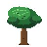 | 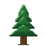 | 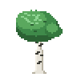 | 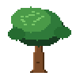 |  |
| **Oak** | **Pine** | **Birch** | **Maple** | **Palm** |
| 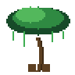 | 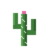 | 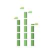 |  | 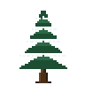 |
| **Jungle** | **Cactus** | **Bamboo** | **Acacia** | **Snow Pine** |
|  | 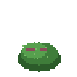 |  | 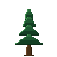 | 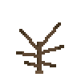 |
| **Apple** | **Berry Bush** | **Blossom** | **Spruce** | **Dead Tree** |
|  |  |  |  | 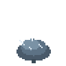 |
| **Agave** | **Shrub** | **Tumbleweed** | **Fern** | **Frost Bush** |
|  | 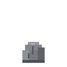 |  |  |  |
| **Pebble** | **Rock** | **Boulder** | **Great Bush** | **Bramble** |

Full vegetation atlas:


---

## 🐟 The Sea — 6 Fish Species

Two-frame swim cycles, depth-submerged schools, distance-culled for performance:


| 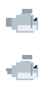 |  | 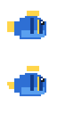 | 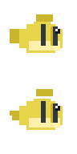 | 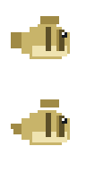 |  |
|:---:|:---:|:---:|:---:|:---:|:---:|
| **Sardine** | **Clownfish** | **Blue Tang** | **Angelfish** | **Puffer** | **Tuna** |


---

## 👤 Villagers & Characters

Every villager is procedurally generated with unique hair, beard, skin, and clothing variants:


Sleep pose with rising ZZZ:


**Special characters:**
- 🟡 **Subject-Zero** — Yellow Hazmat Suit operative with pixel helmet visor, biohazard emblem, and hazard boots
- 🏕️ **Eden Haven Family** — Adam, Eve, Cain & Abel with unique fleeing AI and `!` reaction bubbles

---

## 🔥 Camp, Fire & Lighting


- **Dual animated pixel flames** with warm point lights and radial fire glow halos
- **Cyan hologram shader** — scanlines, micro-flicker, camera billboarding
- **Lightning flash** with expanding shockwave rings
- **Day/night celestial cycle:**


---

## 🫀 Anatomy System

Full body view with organ sprites — tap 🫀 on any villager:

|  | 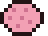 | 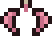 | 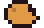 | 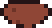 |  |
|:---:|:---:|:---:|:---:|:---:|:---:|
| **Heart** | **Brain** | **Lungs** | **Stomach** | **Liver** | **Guts** |
|  | 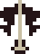 | 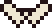 |  |  | |
| **Skull** | **Spine** | **Pelvis** | **Arm Bone** | **Leg Bone** | |

---

## ⚔️ Survival & Evolution Assets

**26 code-painted pixel art assets** spanning human evolution — Stone Age → Medieval → Modern → Sci-Fi:

### 🦣 Wildlife
`mammoth` · `sabertooth` · `boar` · `rabbit` · `eagle` · `bee`

### 🏚️ Housing (by era)
`thatchhut` · `logcabin` · `stonecottage` · `concretebunker` · `cyberhab`

### ⚔️ Weapons
`flintspear` · `ironsword` · `tacticalrifle` · `plasmasaber`

### 🚗 Vehicles
`chariot` · `survivaljeep` · `hovercraft`

### 🦈 Marine Predators
`greatwhite` · `octopus` · `seaturtle`

### 🪵 Resources & Props
`woodpile` · `poppy` · `sunflower` · `beehive` · `ironore`

> 📋 Full technical reference with pixel art and palettes → **[SPRITESHEET.md](SPRITESHEET.md)**

---

## 🎮 Controls

| Action | Keyboard | Touch / Mobile |
|--------|----------|----------------|
| Rotate camera | Mouse drag / `← ↑ ↓ →` | Drag finger |
| Move | `W A S D` | Virtual joystick |
| Fly up / down | `R` / `F` | Up / Down buttons |
| Box-select villagers | Click & drag | Drag on screen |
| Toggle assets panel | Click `»` button | Tap icon |
| Toggle UI | Click 👁 | Tap eye button |
| Regenerate world | 🌍 button | Button on rail |
| Top-view camera | 🗺️ button | Button on rail |
| Pause / resume time | `Space` | Tap ❚❚ |
| Speed up time | ×2 / ×4 / ×6 / ×10 / ×25 buttons | Same |

---

## 🛠️ Run Locally

```bash
git clone https://github.com/FREECANDY-DEV/pixel-world.git
cd pixel-world
npm install
npm run dev
```

Open `http://localhost:3000` — the entire game is **plain JavaScript modules** with a single entry point in `main.js`.

---

## 🤝 Contributing

1. Fork the repo
2. Create a feature branch (`git checkout -b my-feature`)
3. Make changes & ensure the demo still works
4. Open a Pull Request with screenshots

Please keep the **no-asset philosophy** intact — everything is painted by code!

---

## 📜 License

**MIT** — see [LICENSE](LICENSE) for details.

---

<p align="center">
  <i>Every pixel, every tree, every fish — painted by code. Welcome to the tribe. 🔥</i>
</p>

