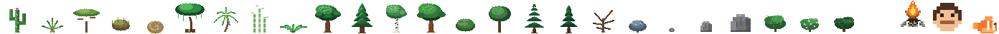

# 🎨 Pixel World — Spritesheet Reference

> Every sprite in Pixel World is **painted by code** at runtime — no image files are loaded.
> The pixel art lives in painter functions inside `main.js`, and each sprite below is a
> **live capture** of what those painters produce. This doc catalogs every sprite, where it
> lives in the code, and what it looks like.

---

## 1. Vegetation Atlas — `treeAtlasCanvas`

The heart of the plant world: **25 species**, one 48×48 cell per species.

- Cell size: **48×48 px**, one column per species (`ATLAS_CELL`), ground line ≈ y 46.
- **4 season rows** per column: spring (row 0), summer (row 1), autumn (row 2), winter (row 3).
- Autumn/winter rows are derived from the painted summer base by `deriveSeasons()`
  (hue-shift to the species' autumn color, snow tinting, leaf-drop).
- Uploaded once as `treeAtlasTex` (NearestFilter, SRGB) and sampled by the wind-shader.
- Zoomed-out map markers are **1:1 copies** of the summer row — same art, bigger life.

The two season rows the shader blends, morphed through a full year — a strip
of eight species (oak, pine, birch, maple, apple, berry, snow pine, blossom
bush) cycling spring → summer → autumn → winter at the exact blend weight the
in-world trees use:

| Art | Key | Label | Biome | Description |
|-----|-----|-------|-------|-------------|
|  | `cactus` | Cactus | desert | Green saguaro column with lighter highlight edge, dark ribs, two side arms, spine dots. |
|  | `agave` | Agave | desert | Rosette of stiff pointed leaves fanning from a dry centre, blue-green tones. |
|  | `acacia` | Acacia | desert | Tall slim dark trunk, flat wide umbrella canopy, dusty olive greens; turns ochre in autumn. |
|  | `shrub` | Desert Shrub | desert | Low scrubby ball of twiggy grey-green stems. |
|  | `tumble` | Tumble Bush | desert | Round skeletal tumbleweed, tan criss-cross branches. |
|  | `jungle` | Jungle Tree | jungle | Massive broadleaf: thick trunk, huge layered canopy blobs, deep greens. |
|  | `palm` | Palm | jungle | Curved ringed trunk leaning with the wind, 7 arcing fronds, coconut cluster at the crown. |
|  | `bamboo` | Bamboo | jungle | Cluster of segmented yellow-green culms with leaf tufts; autumn golds. |
|  | `fern` | Fern Thicket | jungle | Low spread of arching fronds. |
|  | `oak` | Oak | forest | **Pro-art pass**: shaded bark trunk (lit left edge, knots, root flare) + volumetric canopy (AO under-mass, lit upper-left cap, dithered shine, depth holes), side boughs. Blossoms in spring, fiery orange in autumn. |
|  | `pine` | Pine | forest | **Pro-art pass**: gradient trunk + 4 conical tiers, each tier lit on its upper-left edge and separated by an under-skirt shadow line. |
|  | `birch` | Birch | forest | **Pro-art pass**: white bark with black lenticel dashes, airy light-green canopy with shine dither. Spring blossoms, gold autumn. |
|  | `maple` | Maple | forest | **Pro-art pass**: broad two-sided crown spilling over a shaded trunk, dense 4-tone green shading. Crimson red in autumn. |
|  | `berry` | Berry Bush | forest | Rounded bush with scattered dark-red berry pixels. |
|  | `apple` | Apple Tree | forest | Rounded canopy dotted with red apple pixels. |
|  | `snowpine` | Snow Pine | snow | Conical tiers with white snow caps along each skirt + summit dot. |
|  | `spruce` | Spruce | snow | **Pro-art pass**: slim dark spruce, 4 tight tiers with lit edges and shadow lines under each skirt. |
|  | `dead` | Dead Tree | snow | Bare gnarled trunk with broken branch stubs, no foliage. |
|  | `frostbush` | Frost Bush | snow | Low bush with icy-white frosting on top. |
|  | `pebble` | Small Rock | all | Single grey stone lump with highlight. |
|  | `rock` | Medium Rock | all | Faceted grey boulder, darker base shade. |
|  | `boulder` | Big Rock | all | Large two-tone boulder with cracks and moss hints. |
|  | `greatbush` | Great Bush | forest | Big rounded shrub taller than a villager. |
|  | `bloom` | Blossom Bush | forest | Green mound covered in pink/white blossom specks. |
|  | `bramble` | Bramble Tangle | jungle | Chaotic thorny tangle with dark thorn ticks. |

---

## 2. Fish Atlas — `fishAtlasCanvas` (192×64)

The sea's cast of six, each 32×32 px with a two-frame swim cycle.

- 6 species × 32px cells, two rows: row 0 tail-left, row 1 tail-right (swim animation).
- Painted by `paintFish(g, ox, oy, k, frameB)` directly into card thumbs / map chips too.
- **Sparse & deep**: schools are rare (one per ~7.5-unit cell, ~45% of cells) and
  cruise fully submerged (1.8–4+ blocks below the surface, never scraping the seabed),
  so the sea reads as occasional passing shoals — not a constant rain of pixels.
- `DoubleSide` billboards so they're visible from above *and* below the surface.
- **Distance-culled**: schools farther than 320 units from the camera aren't drawn.

The two-frame swim cycle in action — a clownfish doing the exact tail flap the
shader flips, plus the swell bob, frame-for-frame from `paintFish`:

…and the whole cast flapping in sync:

| Art | Cell | Species | Body | Belly | Fin | Stripe |
|-----|------|---------|------|-------|-----|--------|
|  | 0 | Sardine | silver-blue `#b8c4cc` | pale | grey | — |
|  | 1 | Clownfish | orange `#f4772e` | light orange | orange | white bands |
|  | 2 | Blue Tang | royal blue `#2e6fd4` | sky | yellow | navy |
|  | 3 | Angelfish | golden yellow | pale lemon | olive | dark vertical band |
|  | 4 | Puffer | sandy khaki | cream | brown | spikes when puffed |
|  | 5 | Tuna | steel blue | silver | slate | dark back stripe |

---

## 3. Map Icon Atlas — `iconAtlasCanvas`

One row of **48px cells** mirroring `KIND_ORDER` plus special chips. Tree/bush/rock
chips are **1:1 copies of the summer vegetation row** (`ICON_CELL = ATLAS_CELL`),
so zoomed-out markers show the exact same art as the in-world trees — just fewer
and bigger (each marker represents a whole grove).

- Tree chips (per species): **1:1 copy of the tree's exact current season art** —
  the same two atlas rows the wind-shader blends, mixed with the same weight, so
  a zoomed-out marker shows the tree exactly as it looks in-world (spring
  blossoms, autumn gold, winter snow included). The icon atlas rebuilds whenever
  the season changes. One representative marker per ~64u area.
- Campfire chip (`FIRE_COL`): log teepee + flame overlay.
- Face chip (`FACE_COL`): villager head icon for people markers.
- Fish chips (`FISH_COL + i`, one per species, painted straight via `paintFish`):
  the sea floor is flood-filled into connected **water bodies** (deep water, 3+
  blocks) and ONE marker is emitted per (body, species) — a whole ocean shows at
  most six spots, one per fish type, instead of a scatter of clones.

---

## 4. Villagers

The **animated villager variants** — every 3 seconds a different look from
the spawn pool (hairstyle, beard, skin, clothes), all painted by the same
`artVariant` / `pickLook` code the tribe uses:

And the **sleep pose** with its rising ZZZ cycle — eyes shut, lash lines,
curled up, `zZ` energy bar:

- Base rows in `CAVEMAN_ART` / `CAVEWOMAN_ART` char maps with palette lookup;
  per-villager variants restyle hair/beard/clothes (`artVariant`) using `LOOK_POOL`.
- Age stages scale height (child → adult → elder); three materials per villager:
  `[matR, matL, matSleep]`.
- **Subject-Zero (Yellow Hazmat Suit Model)**: Custom hazard suit look (`#ffd23f` skin/suit), pixel helmet visor, biohazard chest emblem, oxygen tank pack, and hazard boots.
- **Eden Haven Family (Adam, Eve, Cain, Abel)**: Unique caveman models living at Eden Camp (`homePos = (220, 180)`), equipped with fleeing AI that pops `!` reaction bubbles and flees at high speed (`3.4`) whenever a player approaches within 7.0 blocks.
- **Sleep art**: eyes closed (`S` glyph with lash pixels below), baked −90° rotation into a
  lying pose canvas (`matSleep`) — head to the left, body along the ground.
- **The founding couple spawns asleep** by the campfire and only wakes when you strike
  the first campfire (`tribeAwoken`).
- Name tag sprite above each head (canvas): name · age, **health bar** (green→red),
  **energy bar** (amber→red, blue + `zZ` while asleep).

---

## 5. Camp, Holograms & Lighting Effects

- **Cyan Pixel Hologram Shader (`makeHologramMat()`)**: Custom `ShaderMaterial` assigned to Grunk the Elder. Features cyan `#00f0ff` scanlines (`sin(vUv.y * 95.0 - uTime * 9.0)`), micro-flicker signal simulation, view-space camera billboarding (`modelViewMatrix * vec4(0,0,0,1)`), and ground pivot anchoring (`position.y + 0.5`).
- **Lit World Campfires & Dual Pixel Flames**: Every campfire across the world is ignited with dual animated pixel flame sprites (`makeFlameSprite()`), warm point lights (`PointLight(0xff9a3c)`), and radial fire glow halos (`makeGlowSprite()`).
- `CAMPFIRE` char-map art: stone ring + crossed logs teepee; `FLAME` overlays animated fire.
- ZZZ stream: three rising "z" glyphs fading in loop above sleepers (`drawZzz`).
- Reaction bubbles: ascii `!`, `!!`, `?!`, `‼`, `✦` (+`✨` for the Water discovery).
- Lightning bolt polyline flash + expanding shockwave rings.
- **Camp label sprite** above the camp (`campLabelCanvas`, 256×72): a little
  pixel house with a stepped roof and door, outlined `CAMP` text, and a
  pixel-person icon carrying the live villager count.
- **Space dressing & Starfield Canvas (`#starfield-bg`)**: A full-viewport background canvas rendering 450+ twinkling stars (`#ffffff`, `#ffd23f`, `#38bdf8`) with 4-point sparkle flares (`+`), soft ambient glow halos, and fast shooting meteors with linear alpha trails. Hand-pixelled moon skin (`makeMoonTexture`, 64×32) — pale regolith with speckle and rimmed craters — plus a radial-glow sun sprite that dresses the planet view.

---

## 6. Asset Panel Zoom-Fit Thumbnails (`paintThumbFromAtlas`)

In the Assets Panel (`#assets-panel`), small bushes (*Berry Bush*, *Frost Bush*, *Desert Shrub*, *Tumble Bush*, *Fern Thicket*, *Great Bush*, *Blossom Bush*, *Bramble Tangle*) and rocks (*Pebbles*, *Rocks*, *Boulders*) occupy only ~12-18px at the bottom of the 48x48 atlas cell. 

- `paintThumbFromAtlas(tg, col, kind)` reads the exact pixel bounding box `[a0, a1, b0, b1]` from `TREE_CELL_BOUNDS[col]`.
- Crops and scales up the plant graphics up to **2.5x zoom**, auto-centering `(dx, dy)` inside the 48x48 thumbnail canvas with crisp pixel art rendering (`imageSmoothingEnabled = false`). All vegetation species are crisp, large, and 100% clearly visible!

---

## 7. Anatomy view — `ANAT_ART` + `BODY_MAP`

The 🫀 anatomy sheet's organ sprites, painted from char maps via `anatSprite`:

| Art | Sprite | What it looks like |
|-----|--------|--------------------|
|  | `heart` | red valved heart, pale top-left highlight |
|  | `brain` | pink convoluted lobes, dark outline |
|  | `lungs` | two grey-pink lobes flanking a trachea |
|  | `stomach` | orange J-pouch with darker edge |
|  | `liver` | dark maroon slab, lighter top edge |
|  | `guts` | coiled pink intestines, outlined |
|  | `skull` | white cranium, dark eye sockets, teeth row |
|  | `spine` | vertebrae column with a rib fan |
|  | `pelvis` | butterfly-shaped hip bones |
|  | `armbone` | long bone with knuckle joints at both ends |
|  | `legbone` | long bone with knuckle joints at both ends |

- `BODY_MAP`: a 26×46 silhouette of a ~7.5-heads-tall figure (crown → feet) with
  regions keyed `h` head · `n`/`t` torso · `a`/`b` arms · `l`/`r` legs;
  `BODY_BOXES` derives per-part bounds so `partIconURL()` crops each body part
  into a 4×-scaled icon for the part list.
- Wound chips are small DOM pills (bleeding / scratched / bruised / fractured /
  damaged) layered on each part row.

---

## 8. UI Glyphs & Celestial Icon (DOM & Canvas)

👁 toggle UI · 🌍 regenerate · 🔄 auto-spin · 🗺️ top view · 🏠 home · ⬚ box-select ·
❚❚ pause · 👤 villager panel · » assets panel · 🫀 anatomy · 📖 knowledge book ·
🔒 locked knowledge nodes · ☀️/🍂/❄️/🌸 season pill · 🐟 sea-life tab

### Sky pill icon — `celestial-icon` (48×48 canvas)

`drawCelestialIcon` paints the live sky in the season pill: a warm sun disc with
8 rotating rays (dusk-shifted colour), four twinkling stars, and a moon that
fades in as night falls. The whole 24-hour cycle, re-rendered exactly as the
game does (sun angle derived from the hour of day):

---

### Palette conventions

- Outline-free soft pixel style; 1px highlights top-left, 1px shade bottom-right.
- Greens ramp: `#123420 → #173d22 → #256b35 → #3f8a4c → #6fd074 → #8fe093`.
- Bark ramps: `#462c16 → #5a3a1e → #6b4526 → #8a5a33 → #96613a`.
- Helpers: `tpx` rect, `tblob` ellipse, `ttrunk` shaded bark, `tcanopy` volumetric foliage.
